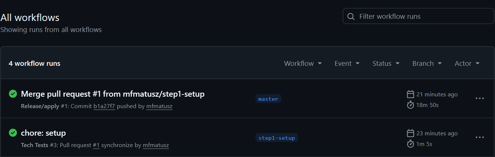
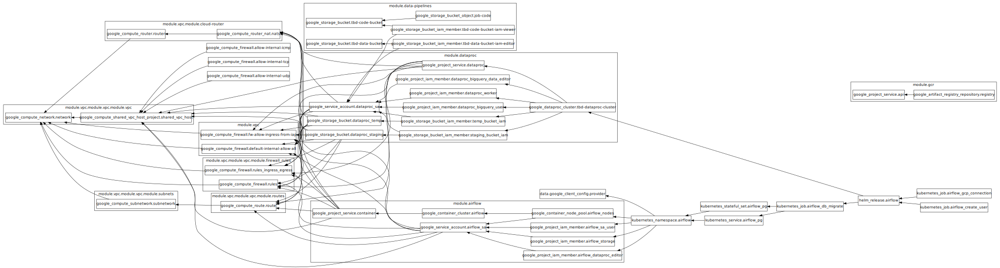
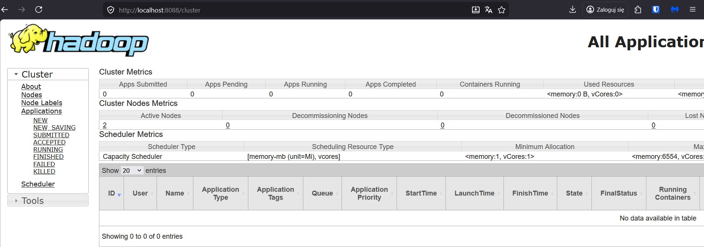
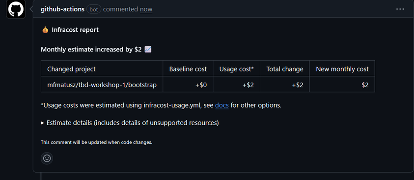
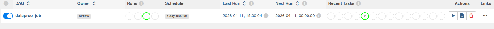
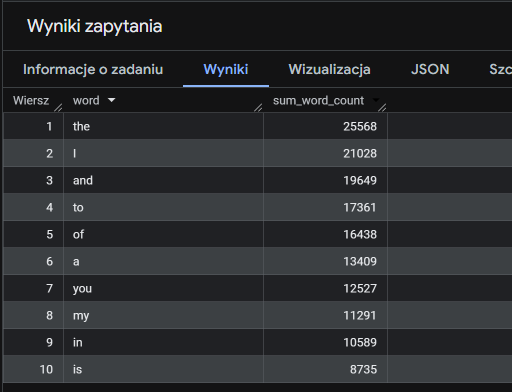
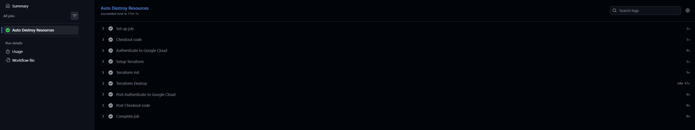

IMPORTANT ❗ ❗ ❗ Please remember to destroy all the resources after each work session. You can recreate infrastructure by creating new PR and merging it to master.


                                                                                                                                                                                                                                                                                                                                                                                  
## Phase 1 Exercise Overview

  ```mermaid
  flowchart TD
      A[🔧 Step 0: Fork repository] --> B[🔧 Step 1: Environment variables\nexport TF_VAR_*]
      B --> C[🔧 Step 2: Bootstrap\nterraform init/apply\n→ GCP project + state bucket]
      C --> D[🔧 Step 3: Quota increase\nCPUS_ALL_REGIONS ≥ 24]
      D --> E[🔧 Step 4: CI/CD Bootstrap\nWorkload Identity Federation\n→ keyless auth GH→GCP]
      E --> F[🔧 Step 5: GitHub Secrets\nGCP_WORKLOAD_IDENTITY_*\nINFRACOST_API_KEY]
      F --> G[🔧 Step 6: pre-commit install]
      G --> H[🔧 Step 7: Push + PR + Merge\n→ release workflow\n→ terraform apply]

      H --> I{Infrastructure\nrunning on GCP}

      I --> J[📋 Task 3: Destroy\nGitHub Actions → workflow_dispatch]
      I --> K[📋 Task 4: New branch\nModify tasks-phase1.md\nPR → merge → new release]
      I --> L[📋 Task 5: Analyze Terraform\nterraform plan/graph\nDescribe selected module]
      I --> M[📋 Task 6: YARN UI\ngcloud compute ssh\nIAP tunnel → port 8088]
      I --> N[📋 Task 7: Architecture diagram\nService accounts + buckets]
      I --> O[📋 Task 8: Infracost\nUsage profiles for\nartifact_registry + storage_bucket]
      I --> P[📋 Task 9: Spark job fix\nAirflow UI → DAG → debug\nFix spark-job.py]
      I --> Q[📋 Task 10: BigQuery\nDataset + external table\non ORC files]
      I --> R[📋 Task 11: Spot instances\npreemptible_worker_config\nin Dataproc module]
      I --> S[📋 Task 12: Auto-destroy\nNew GH Actions workflow\nschedule + cleanup tag]

      style A fill:#4a9eff,color:#fff
      style B fill:#4a9eff,color:#fff
      style C fill:#4a9eff,color:#fff
      style D fill:#ff9f43,color:#fff
      style E fill:#4a9eff,color:#fff
      style F fill:#ff9f43,color:#fff
      style G fill:#4a9eff,color:#fff
      style H fill:#4a9eff,color:#fff
      style I fill:#2ed573,color:#fff
      style J fill:#a55eea,color:#fff
      style K fill:#a55eea,color:#fff
      style L fill:#a55eea,color:#fff
      style M fill:#a55eea,color:#fff
      style N fill:#a55eea,color:#fff
      style O fill:#a55eea,color:#fff
      style P fill:#a55eea,color:#fff
      style Q fill:#a55eea,color:#fff
      style R fill:#a55eea,color:#fff
      style S fill:#a55eea,color:#fff
```

  Legend

  - 🔵 Blue — setup steps (one-time configuration)
  - 🟠 Orange — manual steps (GCP Console / GitHub UI)
  - 🟢 Green — infrastructure ready
  - 🟣 Purple — tasks to complete and document in tasks-phase1.md

1. Authors:

   ***7***

   ***[link to forked repo](https://github.com/mfmatusz/tbd-workshop-1)***

2. Follow all steps in README.md.

3. From available Github Actions select and run destroy on master branch.

4. Create new git branch and:
    1. Modify tasks-phase1.md file.

    2. Create PR from this branch to **YOUR** master and merge it to make new release.

    ***place the screenshot from GA after successful application of release***


5. Analyze terraform code. Play with terraform plan, terraform graph to investigate different modules.

    ***describe one selected module and put the output of terraform graph for this module here***
```json
# module.airflow.google_container_cluster.airflow:
resource "google_container_cluster" "airflow" {
    cluster_ipv4_cidr                        = "10.92.0.0/14"
    datapath_provider                        = null
    default_max_pods_per_node                = 110
    deletion_protection                      = false
    description                              = null
    enable_autopilot                         = false
    enable_cilium_clusterwide_network_policy = false
    enable_intranode_visibility              = false
    enable_kubernetes_alpha                  = false
    enable_l4_ilb_subsetting                 = false
    enable_legacy_abac                       = false
    enable_multi_networking                  = false
    enable_shielded_nodes                    = true
    enable_tpu                               = false
    endpoint                                 = "34.62.70.68"
    id                                       = "projects/tbd-2026l-324932/locations/europe-west1-b/clusters/airflow-cluster"
    initial_node_count                       = 1
    label_fingerprint                        = "a9dc16a7"
    location                                 = "europe-west1-b"
    logging_service                          = "logging.googleapis.com/kubernetes"
    master_version                           = "1.35.1-gke.1396002"
    monitoring_service                       = "monitoring.googleapis.com/kubernetes"
    name                                     = "airflow-cluster"
    network                                  = "projects/tbd-2026l-324932/global/networks/main-vpc"
    networking_mode                          = "VPC_NATIVE"
    node_locations                           = []
    node_version                             = "1.35.1-gke.1396002"
    private_ipv6_google_access               = null
    project                                  = "tbd-2026l-324932"
    remove_default_node_pool                 = true
    self_link                                = "https://container.googleapis.com/v1/projects/tbd-2026l-324932/zones/europe-west1-b/clusters/airflow-cluster"
    services_ipv4_cidr                       = "34.118.224.0/20"
    subnetwork                               = "projects/tbd-2026l-324932/regions/europe-west1/subnetworks/subnet-01"
    tpu_ipv4_cidr_block                      = null

    addons_config {
        dns_cache_config {
            enabled = true
        }
        gce_persistent_disk_csi_driver_config {
            enabled = true
        }
        network_policy_config {
            disabled = true
        }
    }

    binary_authorization {
        enabled         = false
        evaluation_mode = null
    }

    cluster_autoscaling {
        auto_provisioning_locations = []
        autoscaling_profile         = "BALANCED"
        enabled                     = false
    }

    database_encryption {
        key_name = null
        state    = "DECRYPTED"
    }

    default_snat_status {
        disabled = false
    }

    ip_allocation_policy {
        cluster_ipv4_cidr_block       = "10.92.0.0/14"
        cluster_secondary_range_name  = "gke-airflow-cluster-pods-fc215125"
        services_ipv4_cidr_block      = "34.118.224.0/20"
        services_secondary_range_name = null
        stack_type                    = "IPV4"

        pod_cidr_overprovision_config {
            disabled = false
        }
    }

    logging_config {
        enable_components = [
            "SYSTEM_COMPONENTS",
            "WORKLOADS",
        ]
    }

    master_auth {
        client_certificate     = null
        client_key             = (sensitive value)
        cluster_ca_certificate = "LS0tLS1CRUdJTiBDRVJUSUZJQ0FURS0tLS0tCk1JSUVMVENDQXBXZ0F3SUJBZ0lSQUtwSW1wcVFveEU2WGZ1RE81UWJ4Zzh3RFFZSktvWklodmNOQVFFTEJRQXcKTHpFdE1Dc0dBMVVFQXhNa04ySm1OemcyWXpFdE56azJOQzAwWXpRMkxUaGxZakV0WmpJeE1UTXpaVGRrT1RBeQpNQ0FYRFRJMk1EUXhNVEV4TkRVek5Wb1lEekl3TlRZd05EQXpNVEkwTlRNMVdqQXZNUzB3S3dZRFZRUURFeVEzClltWTNPRFpqTVMwM09UWTBMVFJqTkRZdE9HVmlNUzFtTWpFeE16TmxOMlE1TURJd2dnR2lNQTBHQ1NxR1NJYjMKRFFFQkFRVUFBNElCandBd2dnR0tBb0lCZ1FEWmw3NFU4WEpwREhUZDA1NmZjclJoMGVKVmZTd1FqNjl4aDdRegpNaGhpSHFoSzNLQi9FL0F4bmZpWkhmdDBEZHc3QkY1S2JxYTdOVFNDWWZreEZGQ1dsQnZGckN1QjEyM3gxWU9iCklBYzVqeGhtL1NScS95T3dkcllGSk5kZXhSck9MN2lxT1B2bkZ3QVljeUJMalFPbXJaYlFHcHlxVzBlMGRnejMKRjVxNzJGb1h2RHpXNCtpV0xsV2NwdDVXYzFEMjJkM0hQQU1tM1dtbE4wQnZhTVpHWUM3NnhzdTBGdnJxaU9obApqVzBoQW84ZWJUVFU3UjFoaUR4VWM0ZVY0S3VvSmtUdmJNMFVLU3pjbU03L0EvaFQrMmxCM0U3UitRL3RraUoyCjJFYVh2cE5kQ1RSeTBROEZuTndjakxXNmwycEc2OVYyVHpqanBiaUlXOFV3MVp4NVFycjdMd0Rrc1AyU1NjUzAKSEZBOC91c0ZLbEVhNnAxS2pqYnpxS2MwME1RYXBSbTFxeXNLT0Zpb0JkMnVJT1EwN3B5b2NVOERBR0VlaWp4TwpxaWVQYnE3bWxpMWFPM0xYWVdmM1gzcklYTEszczM2Z0hKYzE0cXFwanJ0WWlrc1U4d3h5RGxkU044dS9IK3NwCkErSlU1WnZ2LzM2b1NUdWlwMTJ3QXlhNkJ5OENBd0VBQWFOQ01FQXdEZ1lEVlIwUEFRSC9CQVFEQWdJRU1BOEcKQTFVZEV3RUIvd1FGTUFNQkFmOHdIUVlEVlIwT0JCWUVGTWRLUjA1amRuazZrVElQbit0MzUvQkoxa3htTUEwRwpDU3FHU0liM0RRRUJDd1VBQTRJQmdRQ0JRc0xWRmF5NW1pSlZLOGloZUQyRjlaMEtrRHZWVUZwbDZqVGo5NERCCit4STJzSGhDV1lUbzdnQktQNXd2UW90ZEJWbnFuUHhHRnc3Mlp2ZW9RQ3VaZFc0YVFqR1pVMWZqdGVMT0FZSDkKSnpMaHdmUDhhcDY4Lzg0UDJzZHhWMGpDakYzRkRDV3dDNzRkRUJpei9SYTFrbDd0UUovaExsUytwSDlsM0xNSwpLVjJSN3l0SThEamJudHlHTEN2aHJyaW9TZGFOaXM5VXJNZDdoYlZpUFZ2NGxtWTA2djJxZ0lCbER2UStZN3IxCkRXK0xFcjRjdFZOOE80a1pEa0RHSFZZWVVNM25BRk1HaHg0UmRURFZwZDlXUzRhUjV4ZENIOVVHMDNHcVJ4SW8KSGpRM0hKUWNFY0JkdjBqWldRdm5UTlNtS1ZaY3Y3NWRxckNYdGdJaGNBYjlSUXhUQVJSeGkzNlVPaFFJK09oTgpUMEI3UnBNUnlhRGJDUUxxZkVMOUhFYWhncXVKbXczN3FsbEVaZUtTdFd4VGRrUHEvWERHNERkR0x3c0V0SWlmCk5VVEdVZkhMRW9kaXZ3TzRjL2Nha2xnYmhLeFEwaHBNQzdBZUM3dzEvaExHQjdhVEh1b0ZwZ3hKR2w4OE9rZnYKR0RRQ3N5KzZpdkVpS0MvYnR0S1haUTg9Ci0tLS0tRU5EIENFUlRJRklDQVRFLS0tLS0K"

        client_certificate_config {
            issue_client_certificate = false
        }
    }

    monitoring_config {
        enable_components = [
            "SYSTEM_COMPONENTS",
            "HPA",
            "POD",
            "DAEMONSET",
            "DEPLOYMENT",
            "STATEFULSET",
            "JOBSET",
            "STORAGE",
            "CADVISOR",
            "KUBELET",
            "DCGM",
        ]

        advanced_datapath_observability_config {
            enable_metrics = false
            enable_relay   = false
            relay_mode     = "DISABLED"
        }

        managed_prometheus {
            enabled = true
        }
    }

    network_policy {
        enabled  = false
        provider = "PROVIDER_UNSPECIFIED"
    }

    node_pool_auto_config {
        resource_manager_tags = {}

        node_kubelet_config {
            insecure_kubelet_readonly_port_enabled = "FALSE"
        }
    }

    node_pool_defaults {
        node_config_defaults {
            insecure_kubelet_readonly_port_enabled = "FALSE"
            logging_variant                        = "DEFAULT"
        }
    }

    notification_config {
        pubsub {
            enabled = false
            topic   = null
        }
    }

    private_cluster_config {
        enable_private_endpoint     = false
        enable_private_nodes        = false
        master_ipv4_cidr_block      = null
        peering_name                = null
        private_endpoint            = "10.10.10.5"
        private_endpoint_subnetwork = null
        public_endpoint             = "34.62.70.68"

        master_global_access_config {
            enabled = false
        }
    }

    release_channel {
        channel = "REGULAR"
    }

    security_posture_config {
        mode               = "BASIC"
        vulnerability_mode = "VULNERABILITY_MODE_UNSPECIFIED"
    }

    service_external_ips_config {
        enabled = false
    }
}

```
   

7. Reach YARN UI

   ***place the command you used for setting up the tunnel, the port and the screenshot of YARN UI here***
   ```bash
   gcloud compute ssh tbd-cluster-m --project tbd-2026l-324932 --zone europe-west1-b --tunnel-through-iap -- -L 8088:localhost:8088
   ```
   > YARN UI is accessible inside WSL at `http://localhost:8088` (which propagates to Windows).
   


   Hint: the Dataproc cluster has `internal_ip_only = true`, so you need to use an IAP tunnel.
   See: `gcloud compute ssh` with `-- -L <local_port>:localhost:<remote_port>` and `--tunnel-through-iap` flag.
   YARN ResourceManager UI runs on port **8088**.

7. Draw an architecture diagram (e.g. in draw.io) that includes:
    1. Description of the components of service accounts
       - **tbd-terraform**: CI/CD pipeline component. Used by GitHub Actions via Workload Identity Federation to provision and manage all GCP infrastructure components securely.
       - **airflow_sa**: Compute component. Attached to the GKE cluster (`airflow-cluster`) node pools. It enables Airflow pods to securely interact with GCS buckets (e.g., syncing DAGs) and other APIs.
       - **dataproc_sa**: Data Analytics component. Attached to the Dataproc cluster (`tbd-cluster`) master and worker nodes. It executes Spark jobs and holds permissions to modify BigQuery datasets and access Dataproc specific staging/data buckets.
       - **tbd-composer-sa**: Orchestration component. Managed service account attached to the Cloud Composer environment to execute Airflow tasks.
    2. List of buckets for disposal
       - *Note: In this workshop, all buckets are marked with `force_destroy = true` in Terraform, meaning they are considered ephemeral and will be destroyed by the CI/CD pipeline to save costs.*
       - **tbd-state-bucket**: Stores the Terraform `.tfstate`. It is recreated via the local `bootstrap` process.
       - **dataproc-staging** & **dataproc-temp**: Used by Dataproc/Hadoop to store temporary MapReduce intermediate files and cluster logs. Completely disposable.
       - **tbd-code-bucket** & **notebook-conf-bucket**: Store job scripts (e.g., Spark Python scripts) and Jupyter configurations. They are reproducible because they are copied directly from the GitHub repository.
       - **tbd-data-bucket**: Stores input data and output results from pipelines. In this educational setup, data is treated as temporary and recreated.
       - **mlflow-artifacts-bucket**: Stores ML model artifacts generated during the workshop tasks. 
       - **Production vs. Workshop:** In a real-world production environment, buckets like **tbd-state-bucket**, **tbd-data-bucket**, and **mlflow-artifacts-bucket** would **NEVER** be disposable (`force_destroy = false`). Destroying them would mean a catastrophic loss of Terraform state management, critical business data, and trained ML models. Only "temp", "staging", or "code" (if purely synced from CI/CD) buckets would remain ephemeral.

    ***place your diagram here***
    ```mermaid
    graph TD
        subgraph "Service Accounts"
            SA1[tbd-terraform]
            SA2[airflow_sa]
            SA3[dataproc_sa]
            SA4[tbd-composer-sa]
        end

        subgraph "Storage Buckets (For Disposal)"
            B1[(tbd-state-bucket)]
            B2[(dataproc-staging)]
            B3[(dataproc-temp)]
            B4[(tbd-code-bucket)]
            B5[(tbd-data-bucket)]
            B6[(notebook-conf-bucket)]
            B7[(mlflow-artifacts-bucket)]
        end
        
        SA1 -.->|Manages state code| B1
        SA1 -->|Provisions| Infra[Entire GCP Infrastructure]
        
        SA2 -->|Attached to| GKE[GKE Cluster: airflow-cluster]
        GKE -->|Reads DAGs| B4
        
        SA3 -->|Attached to| DP[Dataproc Cluster: tbd-cluster]
        DP -->|Executes on| BQ[BigQuery Datasets]
        DP -->|Uses| B2
        DP -->|Uses| B3
        DP -->|Reads/Writes| B5
        
        SA4 -->|Attached to| COMP[Cloud Composer Env]
    ```

8. Create a new PR and add costs by entering the expected consumption into Infracost
For all the resources of type: `google_artifact_registry_repository`, `google_storage_bucket`
create a sample usage profiles and add it to the Infracost task in CI/CD pipeline. Usage file [example](https://github.com/infracost/infracost/blob/master/infracost-usage-example.yml)

   ***place the expected consumption you entered here***
   ```yaml
   version: 0.1
   resource_usage:
     google_artifact_registry_repository.*:
       storage_gb: 50
     google_storage_bucket.*:
       storage_gb: 100
       monthly_class_a_operations: 10000
       monthly_class_b_operations: 50000
   ```

   ***place the screenshot from infracost output here***

9. Find and correct the error in spark-job.py

    After `terraform apply` completes, connect to the Airflow cluster:
    ```bash
    gcloud container clusters get-credentials airflow-cluster --zone europe-west1-b --project PROJECT_NAME
    ```
    
    Then check the external IP (AIRFLOW_EXTERNAL_IP) of the webserver service:
    kubectl get svc -n airflow airflow-webserver                                                                                                                                                                 
                                              
                                                                                                                                                                                                               
    ▎ Note: If EXTERNAL-IP shows <pending>, wait a moment and retry — LoadBalancer IP allocation may take 1-2 minutes.  

    DAG files are synced automatically from your GitHub repo via git-sync sidecar.
    Airflow variables and the `google_cloud_default` GCP connection are also configured by Terraform.

    a) In the Airflow UI (http://AIRFLOW_EXTERNAL_IP:8080, login: admin/admin), find the `dataproc_job` DAG, unpause it and trigger it manually.

    ***place a screenshot of the DAG in the Airflow UI***
  
    b) The DAG will fail. Examine the task logs in the Airflow UI to find the root cause.

    ***paste the relevant error message from the Airflow task log***

   ```bash
      26/04/11 15:02:17 INFO RequestTracker: Detected high latency for [url=https://storage.googleapis.com/storage/v1/b/tbd-2026l-9010-data/o/data%2Fshakespeare?fields=bucket,name,timeCreated,updated,generation,metageneration,size,contentType,contentEncoding,md5Hash,crc32c,metadata; invocationId=gl-java/11.0.20 gdcl/2.1.1 linux/6.8.0 gccl-invocation-id/dacc3fbe]. durationMs=368; method=GET; thread=Thread-4 [CONTEXT ratelimit_period="10 SECONDS [skipped: 2]" ]
   26/04/11 15:02:17 INFO PathOutputCommitterFactory: No output committer factory defined, defaulting to FileOutputCommitterFactory
   26/04/11 15:02:17 INFO GhfsGlobalStorageStatistics: Detected potential high latency for operation op_mkdirs. latencyMs=696; previousMaxLatencyMs=258; operationCount=2; context=gs://tbd-2026l-9010-data/data/shakespeare/_temporary/0; thread=Thread-4
   Traceback (most recent call last):
   File "/tmp/6f8c61d7-d722-4c94-afc5-103bd85ca096/spark-job.py", line 42, in <module>
    df.write.mode("overwrite").orc(DATA_BUCKET)
   File "/usr/lib/spark/python/lib/pyspark.zip/pyspark/sql/readwriter.py", line 1927, in orc
   File "/usr/lib/spark/python/lib/py4j-0.10.9.7-src.zip/py4j/java_gateway.py", line 1322, in __call__
   File "/usr/lib/spark/python/lib/pyspark.zip/pyspark/errors/exceptions/captured.py", line 179, in deco
   File "/usr/lib/spark/python/lib/py4j-0.10.9.7-src.zip/py4j/protocol.py", line 326, in get_return_valu
   py4j.protocol.Py4JJavaError: An error occurred while calling o96.orc
   : com.google.cloud.hadoop.repackaged.gcs.com.google.api.client.googleapis.json.GoogleJsonResponseException: 404 Not Found
   POST https://storage.googleapis.com/upload/storage/v1/b/tbd-2026l-9010-data/o?ifGenerationMatch=0&uploadType=multipart
   {
   "code": 404,
   "errors": [
    {
      "domain": "global",
      "message": "The specified bucket does not exist.",
      "reason": "notFound"
    }
   ],
   "message": "The specified bucket does not exist."
   }
    ```

    ***describe what the error is and how you found it***

   looking at the event logs, and then at the link to detailed los, the bucket given in the script did not exist -> replaced with our project's bucket
   

    c) Fix the error in `modules/data-pipeline/resources/spark-job.py` and re-upload the file to GCS:
    ```bash
    gsutil cp modules/data-pipeline/resources/spark-job.py gs://PROJECT_NAME-code/spark-job.py
    ```
    Then trigger the DAG again from the Airflow UI.

    ***paste the link to the fixed file***
    [`modules/data-pipeline/resources/spark-job.py](modules/data-pipeline/resources/spark-job.py)
    d) Verify the DAG completes successfully and check that ORC files were written to the data bucket:
    ```bash
    gsutil ls gs://PROJECT_NAME-data/data/shakespeare/
    ```

    ***place a screenshot of the successful DAG run in Airflow UI***
  
10. Create a BigQuery dataset and an external table using SQL

    Using the ORC data produced by the Spark job in task 9, create a BigQuery dataset and an external table.

    Note: the dataset must be created in the same region as the GCS bucket (`europe-west1`), e.g.:
    ```bash
    bq mk --dataset --location=europe-west1 shakespeare
    ```

    ***place the SQL code and query output here***
    ```sql
    SELECT * FROM shakespeare.main LIMIT 10;
    ```
    
    
    ***why does ORC not require a table schema?***
    
    ORC files are self-describing, they store the column names along with their type and metadata in the file itself
12. Add support for preemptible/spot instances in a Dataproc cluster

    ***place the link to the modified file and inserted terraform code***
    - Link: [modules/dataproc/main.tf](modules/dataproc/main.tf)
    - Inserted terraform code:
    ```hcl
    preemptible_worker_config {
      num_instances = 2
    }
    ```


13. Triggered Terraform Destroy on Schedule or After PR Merge. Goal: make sure we never forget to clean up resources and burn money.

Add a new GitHub Actions workflow that:
  1. runs terraform destroy -auto-approve
  2. triggers automatically:

   a) on a fixed schedule (e.g. every day at 20:00 UTC)

   b) when a PR is merged to master containing [CLEANUP] tag in title

Steps:
  1. Create file .github/workflows/auto-destroy.yml
  2. Configure it to authenticate and destroy Terraform resources
  3. Test the trigger (schedule or cleanup-tagged PR)

Hint: use the existing `.github/workflows/destroy.yml` as a starting point.

***paste workflow YAML here***
```yaml
name: Auto Destroy Infrastructure
on:
  schedule:
    - cron: '0 20 * * *' # Runs daily at 20:00 UTC
  pull_request:
    types:
      - closed # Runs when a PR with a specific tag is merged
      
env:
  TF_VAR_tbd_semester: ${{ vars.TF_VAR_TBD_SEMESTER }}
  TF_VAR_project_name: ${{ vars.TF_VAR_PROJECT_NAME }}

permissions: read-all

jobs:
  auto-destroy:
    name: "Auto Destroy Resources"
    # Check if it's a scheduled run or a merged PR with [CLEANUP] in the title
    if: github.event_name == 'schedule' || (github.event.pull_request.merged == true && contains(github.event.pull_request.title, '[CLEANUP]'))
    runs-on: ubuntu-latest
    permissions:
      contents: read
      id-token: write

    steps:
      - name: Checkout code
        uses: actions/checkout@v3

      - name: Authenticate to Google Cloud
        id: auth
        uses: google-github-actions/auth@v1
        with:
          workload_identity_provider: ${{ secrets.GCP_WORKLOAD_IDENTITY_PROVIDER_NAME }}
          service_account: ${{ secrets.GCP_WORKLOAD_IDENTITY_SA_EMAIL }}

      - name: Setup Terraform
        uses: hashicorp/setup-terraform@v2
        with:
          terraform_version: 1.11.0

      - name: Terraform Init
        id: init
        run: terraform init -backend-config=env/backend.tfvars

      - name: Terraform Destroy
        run: terraform destroy -auto-approve -var-file=env/project.tfvars -lock=false
```

***paste screenshot/log snippet confirming the auto-destroy ran***

*(paste the screenshot of the Auto-Destroy run from the GH Actions tab after merging a Pull Request with the [CLEANUP] tag here)*

***write one sentence why scheduling cleanup helps in this workshop***
Scheduling cleanup is crucial because Big Data components (like Dataproc and external Composer instances) are heavily billable per-hour, so forgetting to destroy resources manually could drain budget overnight.
